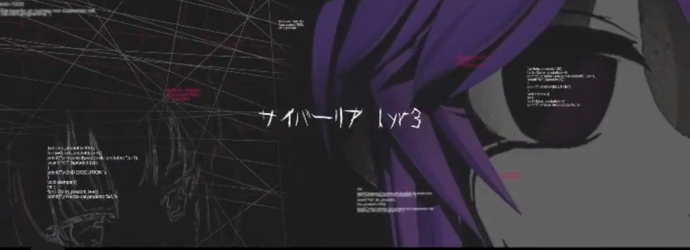

<!--  -->

### **proud projs**
> - [Asteride](https://github.com/Aster-IDE/AsterIDE) - **A Simple Text Editor** written in **Rust**, made for Femboys 🌸
> - [playfairs.cc](https://www.playfairs.cc) - The source of this README.
> - [nix](https://github.com/playfairs/nix) - My [NixOS](https://nixos.org) and [Home Manager](https://home-manager.dev) Configuration
> - [dumbassdog.com](https://dumbassdog.com) - The most peak website you've ever seen
> - [vortex](https://vortex.playfairs.cc) - All-In-One Discord bot written in Python using Discord.py and Jishaku

### **currently working on**
> - [Yet Another Wayland Compositor](https://gitlab.com/yawc.rs) - A batteries-included Wayland Compositor Written in rust using Rustlings
> - [DOOMBOX](https://github.com/playfairs/doombox) - A LiveBoot ISO Creation Tool for DOOM, created from the ground up, EFI and Everything.
> - [ProxyBox](https://github.com/playfairs/proxybox) - A lightweight Rust tool for tunneling and proxying network traffic.
> - [Aegis](https://github.com/the-aegis-foundation) - An All-in-One Operating System focused on Privacy and Anonymity. (Not in active development.)

### **socials**
> - [GitLab](https://gitlab.com/playfairs)
> - [TikTok](https://tiktok.com/@rosepinetheme)
> - [Discord](https://discord.com/users/1426711359059394662)
> - [Spotify](https://open.spotify.com/user/darklore4201)
---

---
